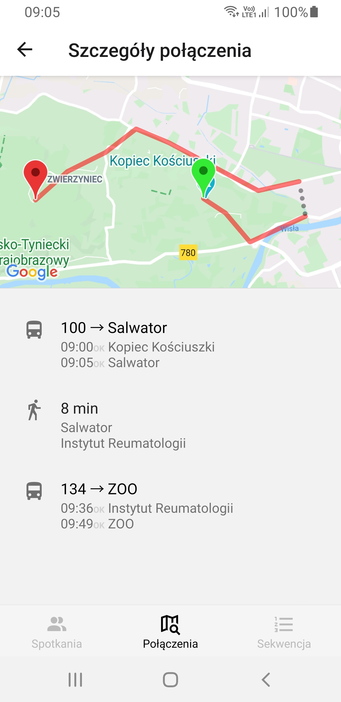
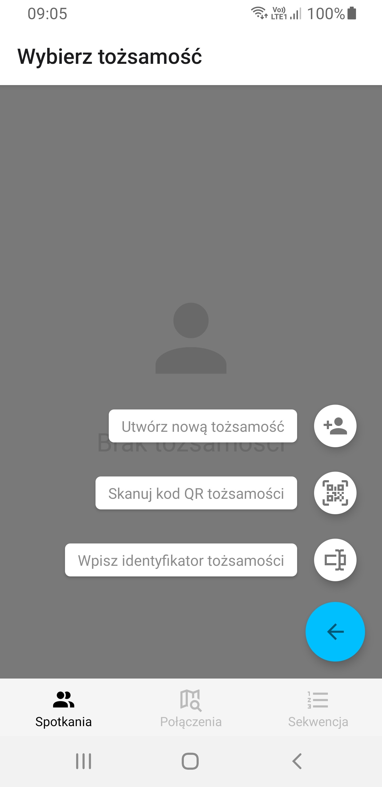
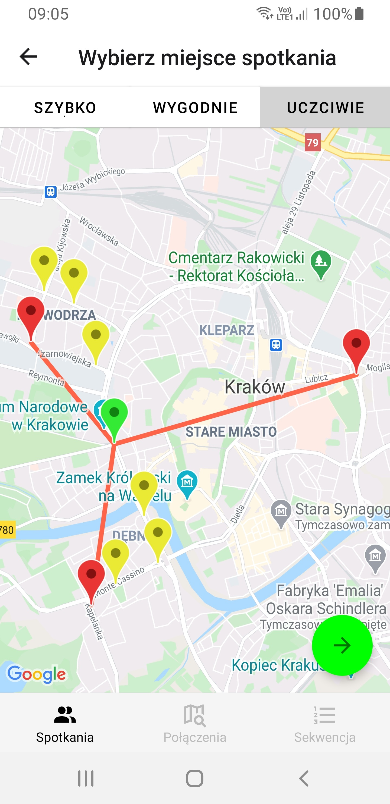

# Krk Meetings

[](https://travis-ci.com/wietlabs/krk_meetings)

**A mobile app that lets you plan group meetings and find optimal connections using means of public transport based on GTFS Static data feed published by Kraków Public Transport Authority.**

Under the hood it uses a custom connection search engine written in Python 3.8 with a great help of pandas and NetworkX. The timetable is automatically fetched from the FTP server on each update. Then it gets parsed into multiple dataframes, which are transformed into different kinds of graphs. Connection solver not only supports multiple changes, but also includes ability to walk between two adjacent stops as well. On top of that, it can be easily configured using explainable human-understandable real-world parameters. For suggesting the best places to meet or an optimal sequence of stops to visit, different types of solvers are used. Due to high modularity it is possible to extend existing solvers or use custom implementations instead of the default ones.

Solvers accept queries via HTTP API. Due to Python interpreter limitations, we use RabbitMQ is utilized to distribute tasks to worker processes. For meeting management a separate microservice has been implemented with Flask and SQLAlchemy ORM connecting to an SQLite database used as meeting data storage.

The mobile app is written in React Native using Expo. We use react-native-maps to visualize current position, nearest stops or connection paths as well as React Native Paper for UI components. In comparision to other similar apps we visualize suggested connections on a 2D plane with colored dots representing number of transfers (e.g. different bus lines). This allows users to compare suggested connections visually without deciding between fast and comfortable beforehand.

For meeting invitations we utilize the deep linking mechanism. These links are supposed to be shared via any instant messaging platforms (e.g. Messenger or WhatsApp). When all members join, the organizer can select meeting spot based on suggestions that include each member's location based with respect to chosen metric.

Since providing personal data such as e-mail address in order to create an account often discourages potential users, we abandoned the classic approach in favor of random UUIDv4 identifiers or "identities". An identity can be easily transferred or copied to other devices by scanning previously generated QR code.

Krk Meetings is being developed as an engineer's project with much pair programming involved during the whole process. Although recently we have been focused on testing and optimization, we still plan to deliver new features in the future.

## Screenshots










# Production

```sh
docker-compose up
```

# Development

## Frontend

```sh
cd frontend
npm install --global expo-cli
expo start
```

## Backend

```sh
cd backend
python -m venv .venv_backend
source .venv_backend/bin/activate
pip install -r requirements.txt -r requirements-dev.txt -e .
python krk_meetings/run.py
```

## Meetings

```sh
cd meetings
python -m venv .venv_meetings
source .venv_meetings/bin/activate
pip install -r requirements.txt -r requirements-dev.txt
python run.py
```

## Testing

```sh
pytest
```
